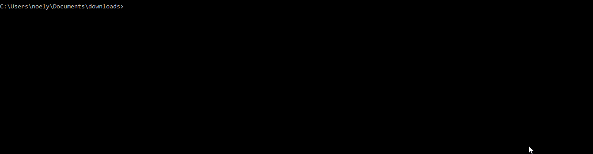

# gonyvido: Video Downloader for Go
[](LICENSE)

A Video Downloder for any Go application

gonyvido provides a higher-level programming interface for integrate video download and conversion features to your go applications.

_IMPORTANT:_ gonyvido is still in development phase so please please feel free to contribute and expand it to other video downloading sites.

install & try it out ! :v:
```
gonyvido --url https://www.youtube.com/watch?v=3sCGysVB41k
```



## Installation

```
go get github.com/noelyahan/gonyvido
```

## Quick Use

```
gonyvido -path "./download/mp3" -mp3 -url https://www.youtube.com/watch?v=_P7S2lKif-A
```

## Usage

```go
package main

import (
	"github.com/noelyahan/gonyvido/api"
)

func main() {
    // go lang song :)
    url := "https://www.youtube.com/watch?v=LJvEIjRBSDA"
    api.GetHQVideo(url).Download()
    // if you need only the audio
    api.GetHQVideo(url).Download().ToMP3()
    /*
    api.GetHQVideo(url) - > get high quality video
    api.GetMQVideo(url) - > get medium quality video
    api.GetLQVideo(url) - > get low quality video
    */	
}
```
## Getting started

If you want to know what it is like to build applications with gonyvido, check [main.go](main.go).

## Related projects

gonyvido is mainly influenced by [youtube.dl](https://rg3.github.io/youtube-dl/) and [kkdai/youtube](https://github.com/kkdai/youtube) offers a similar functionality that has been adapted to Go.

## License

gonyvido is released under the [MIT License](LICENSE).
